.. _gettingstarted:

Jupyter Notebooks
=================

Jupyter is the environment that Pulse3D is designed to be used in. It allows creation
of Python Notebooks which consist of Code Cells (also referred to as just 'cells') that contain Python code,
each of which can be executed independently of others.

.. image:: images/twitch_metrics_diagram.png
    :width: 600

Getting Started with Jupyter
----------------------------

Click |mybinder_link| to navigate to the online notebook.

.. |mybinder_link| raw:: html

   <a href="https://mybinder.org/v2/gh/curibio/jupyter_sdk/v0.23.6?filepath=intro.ipynb" target="_blank">here</a>

You should land on a page that looks like this:

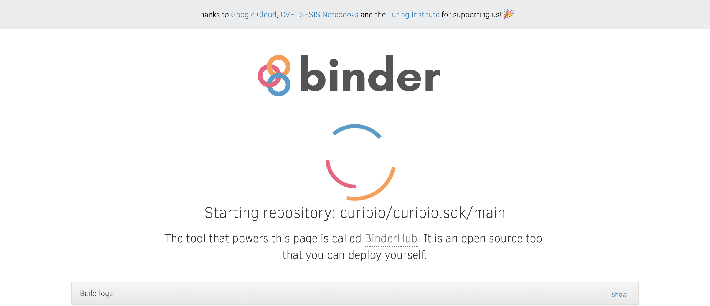

It may take a few minutes to load the notebook. Once it's loaded you should see this page:

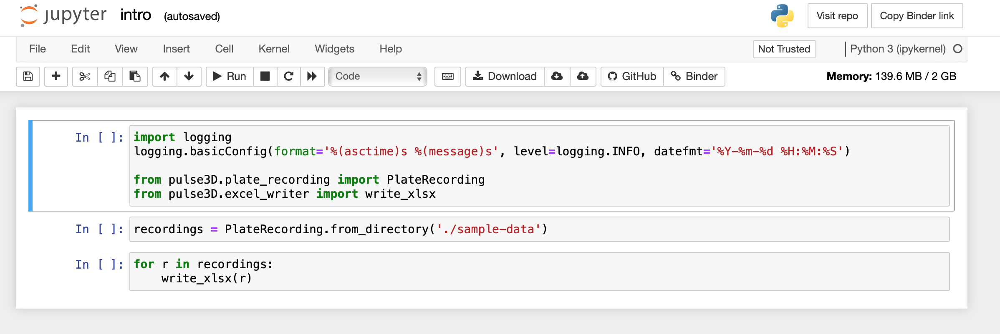

Each block of code is a code cell. When a code cell is running, you will see this to
the left of it:

When a cell completes execution, the star will become a number:

This number corresponds to the order the cells are run in. For this example,
there are only 3 cells, so if they are all ran in order the last cell should
have a 3 next to it. If a cell is re-run, the number will change.

Working With Pulse3D
====================

This section will demonstrate how to upload H5 files to Jupyter, convert them to
an excel sheet, and then download the converted files.

Uploading H5 Files
------------------

1. To begin uploading H5 files, click the Jupyter logo in the top left corner to
   navigate to the file explorer page:

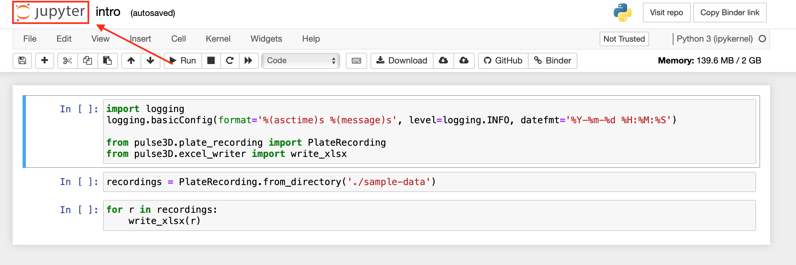

You should now be on this page listing all the folders and files currently in the environment:

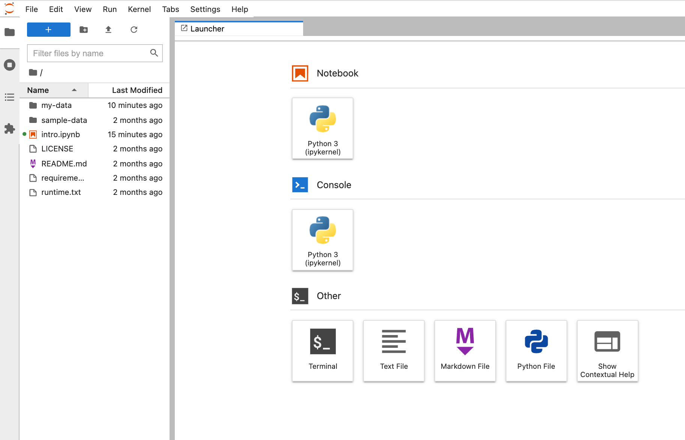

2. Click on ``my-data``. You should now be in the ``my-data`` folder:

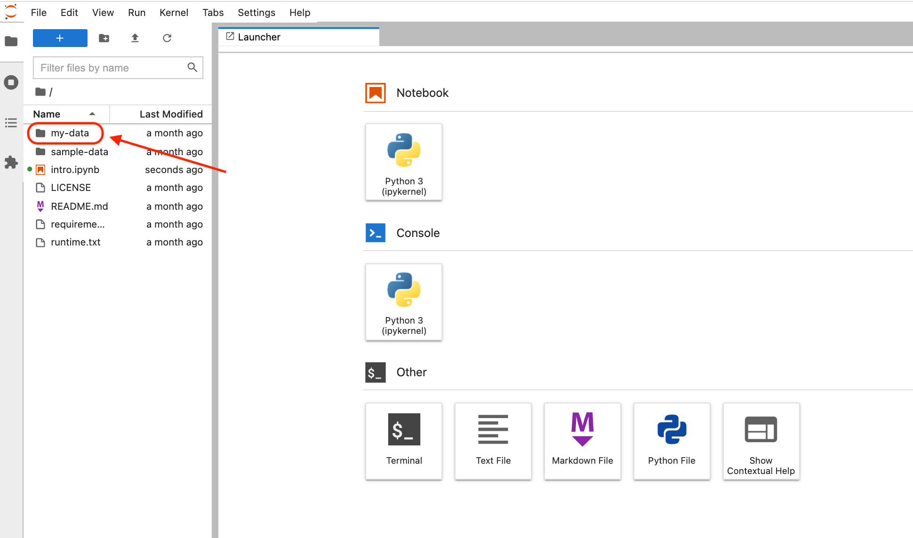

3. Click on the upload button near the top right and select the files you wish to upload.
   You may see an upload button next to each file you selected to upload.
   If this happens, just click the new upload button next to each file to complete the process.

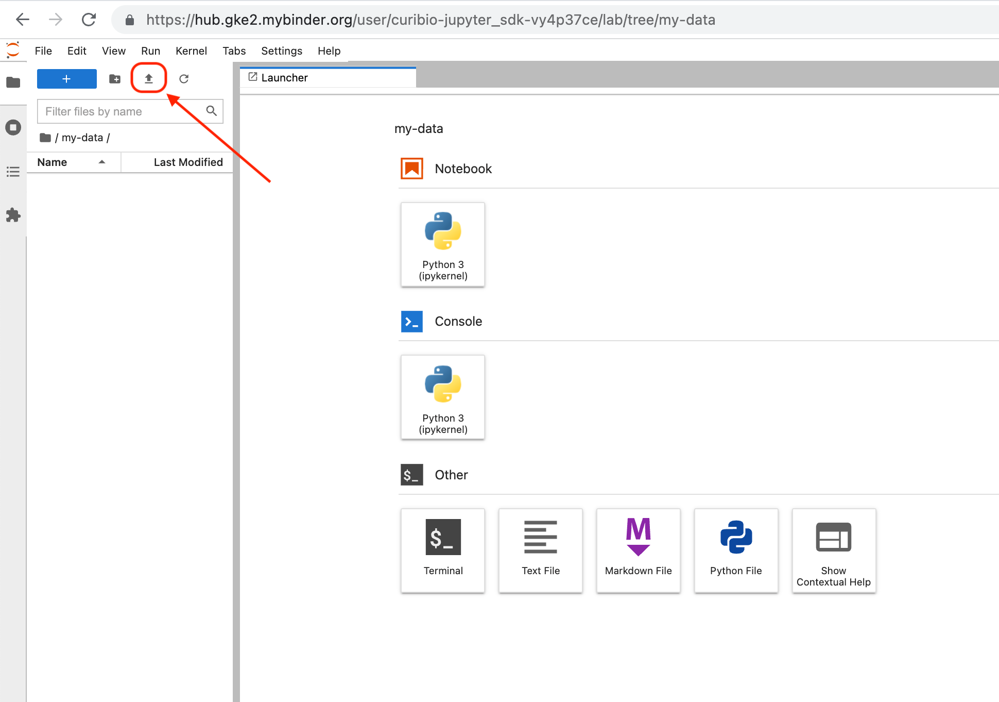

When the uploads complete, the page should look like this:

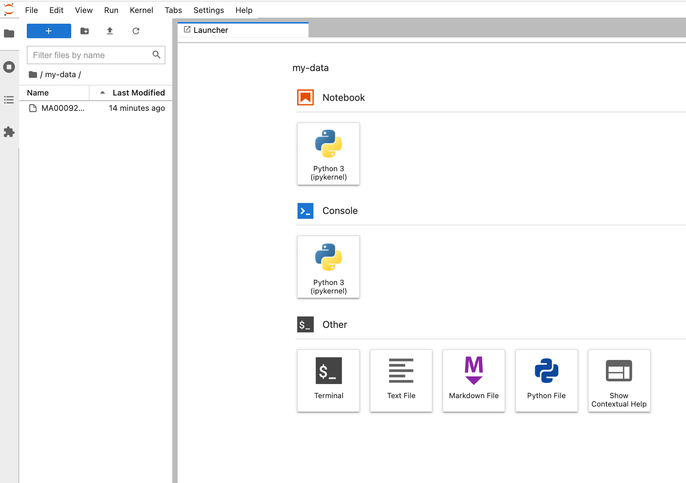

Alternatively, you can upload multiple files as a ``zip`` file to speed up the
upload process. To do so on Windows, just select the local files you wish to zip.
Then, right click on the selection, and choose ``Send to`` ->
``Compressed (zipped) folder``:

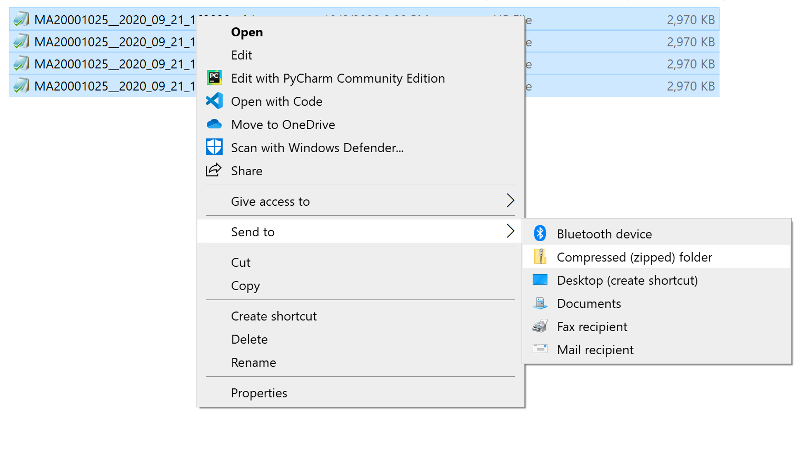

After zipping you should see the ``zip`` file. This file will likely have the same
name as one the the files you zipped as shown here:

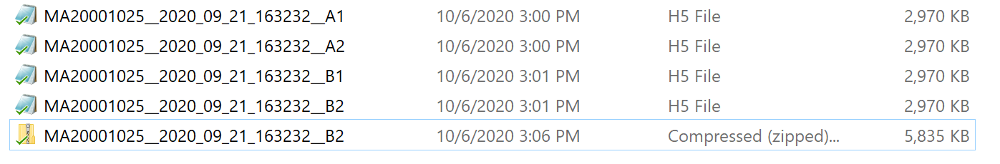

You can rename this ``zip`` file if you'd like to before uploading. Once the
files are zipped together, remember to only upload the ``zip`` file.

4. Once you finish uploading the file(s), click the tabs icon in the far left vertical menu here:

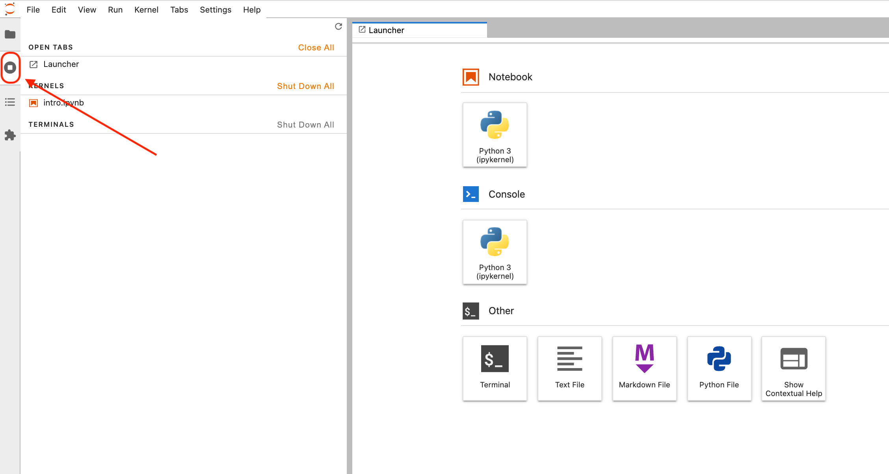

5. To return to the notebook click on intro.pynb here:

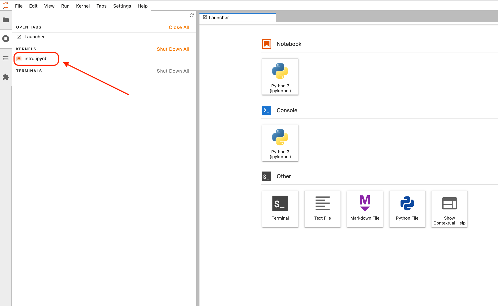

Note about uploading zip files
------------------------------

Only one zip file can be in the ``my-data`` folder at a time.
If you need to analyze multiple zip files:

1. Follow the steps in the next section to export the data from the first zip file.

2. Navigate back to the ``my-data`` folder and remove all the items in it.

3. Upload the next zip file.

This process can be repeated for any number of zip files. Alternatively, you can open
a new notebook for each other zip file you want to analyze.

Exporting Data to an Excel File and Downloading
-----------------------------------------------

1. Starting from the main files page, navigate back to the notebook
   page by clicking on ``intro.ipynb``.

2. Before running any code cells, you will need to update the file location.
   Change the line::

      recording = PlateRecording.from_directory('./sample-data')

   to::

      recording = PlateRecording.from_directory('./my-data')

3. You can now begin running the code. To do so, click ``Cell`` near the top left, then click ``Run All``:

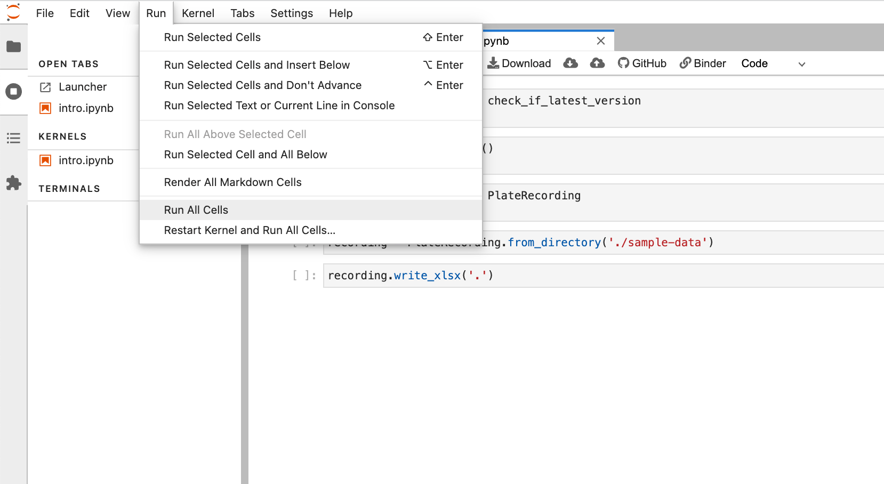

If there are many files, it may take a minute or two to convert all of them.
Progress messages will be printed to indicate the code is working and not frozen.
When all cells complete execution there should be a number next to every cell.
You will also see a message printed underneath the last cell indicating that
writing to the ``.xlsx`` file is complete:

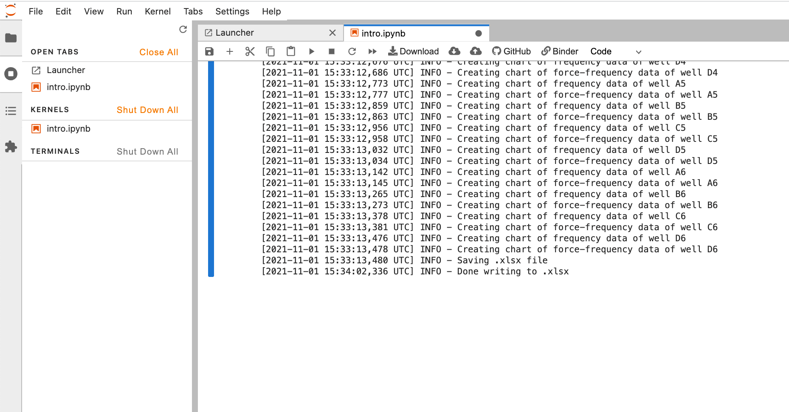

4. Click on the Jupyter Logo in the top left of the page again to
go back to the files page. You should should now see a new ``.xlsx`` file. The
name of the file should contain the barcode of the plate the data was recorded from.

5. To download, check the box to the left of the file and then press ``download``
near the top left.

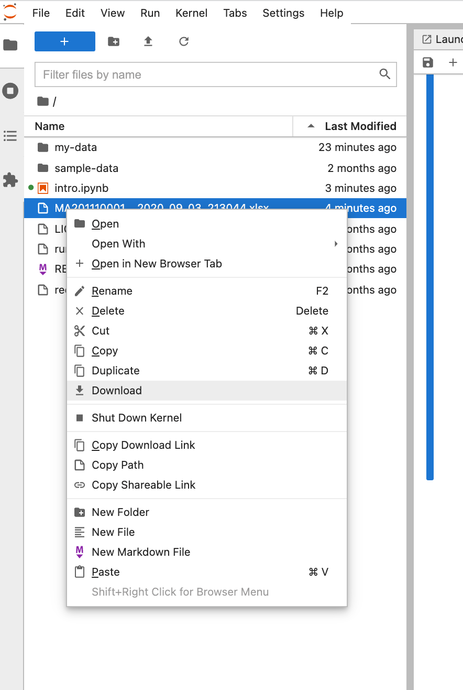

When navigating away from the page you may see the following pop-up dialog:

If all analysis is done and all files have been downloaded,
then it is OK to press ``leave``.

Adding Arguments to write_xlsx()
--------------------------------

There are a few arguments you can add to the ``write_xlsx`` function to modify the ``.xlsx`` output file.
They are:
- ``width_factors``
- ``prominence_factors``
- ``twitch_widths``
- ``start_time``
- ``end_time``

Any combination of these arguments can be given. Omitting them all is fine too.
Their behavior is documented in detail below.

``width_factors``
^^^^^^^^^^^^^^^^^

Specifies how wide a signal should be to classify as a peak.
width factors are supplied as a pair of numbers greater than 0. The parameter is optional, but both numbers
should be provided separated by a comma if prominence factors are being set manually.
By default, this parameter is set to (7,7). The first number is the peak width the second number is valley width.
A few examples of using this argument::

    # peak width = 1, valley width = 3
    write_xlsx(r, width_factors=(1,3))

    # peak width = 20, valley width = 30
    write_xlsx(r, width_factors=(20,30))

``prominence_factors``
^^^^^^^^^^^^^^^^^^^^^^

Specifies how much a peak should stand out compared to the rest of the signal immediately surrounding it.
Prominence factors are supplied as a pair of numbers greater than 0. The parameter is optional, but both numbers
should be provided separated by a comma if prominence factors are being set manually.
By default, this parameter is set to (6,6). The first number is representing the peak prominence and the second number is interpreted as valley prominence.
A few examples of using this argument::

    # peak prominence = 1 valley prominence = 3
    write_xlsx(r, prominence_factors=(1,3))

    # peak prominence = 20 valley prominence = 30
    write_xlsx(r, prominence_factors=(20,30))

``twitch_widths``
^^^^^^^^^^^^^^^^^

Specifies which twitch width values to add to the per twitch metrics sheet and aggregate metrics sheet.
The twitch width values that can be given are any multiple of 5 between 10 and 90 (including 10 and 90).
You can include any combination of valid values. However if a value is included that is either outside
of the accepted range or not a multiple of 5, an error will occur. If this argument is
not given, then by default only 50 and 90 will be written to the output file.
A few examples of using this argument::

    # use only 10, 25, and 90
    write_xlsx(r, twitch_widths=(10, 25, 90))

    # use only 10
    write_xlsx(r, twitch_widths=(10,))

    # use all valid values
    write_xlsx(r, twitch_widths=tuple(range(10, 95, 5)))

``start_time``
^^^^^^^^^^^^^^

Specifies the earliest timepoint (in seconds) to use in analysis.
If not given, the analysis will start from the first recorded timepoint in the recording file.
An example of using this argument::

    # start analysis 5 seconds into the recording
    write_xlsx(r, start_time=5)

    # start analysis 1.5 seconds into the recording
    write_xlsx(r, start_time=1.5)

``end_time``
^^^^^^^^^^^^

Specifies the latest timepoint (in seconds) to use in analysis.
If not given, the analysis will run through the latest recorded timepoint in the recording file.
An example of using this argument::

    # stop analysis 10 seconds into the recording
    write_xlsx(r, end_time=10)

    # stop analysis 12.5 seconds into the recording
    write_xlsx(r, end_time=12.5)
